# 🍿 Popcorn


A modern Flutter movie discovery app. Browse trending films, explore genres, search, build a personal watchlist, and dive into rich movie details — all powered by [TMDB](https://www.themoviedb.org/).

> 📝 **New here? Start with the API key.**
> Popcorn needs a free TMDB v4 read-access token. I wrote a step-by-step guide that walks you through the whole thing, even if you haven't created the project yet:
> **[How to get a TMDB API key (even if your project doesn't exist yet)](https://medium.com/@ozyurek.aydanil/how-to-get-a-tmdb-api-key-even-if-your-project-doesnt-exist-yet-fae8845f00c6)** — Medium

**Status:** ✅ Feature-complete across the five core flows — splash, onboarding, home discovery, movie detail, search, and watchlist. Focus now is polish + tests.

---

## 📱 App Icon

<p align="center">
  
</p>

Custom iOS launch icons, generated from a single source. I wrote a short reminder on how I set this up end-to-end:

**[How to change Flutter app icons (iOS & Android) — a quick reminder](https://medium.com/@ozyurek.aydanil/how-to-change-flutter-app-icons-ios-android-a-quick-reminder-7d1336b65724)** — Medium

---

## ✨ Screenshots

### Splash + Onboarding

<p align="center">
  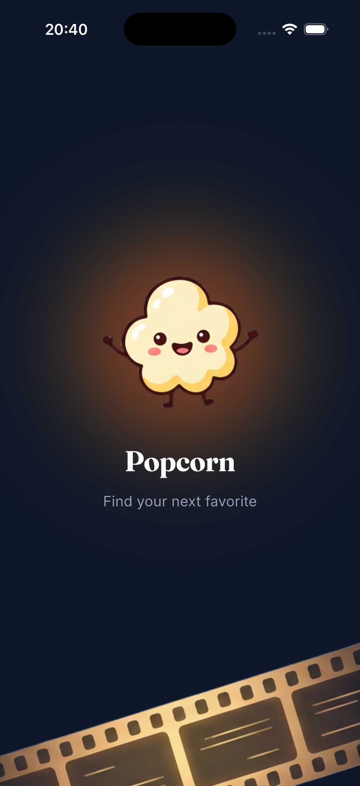
  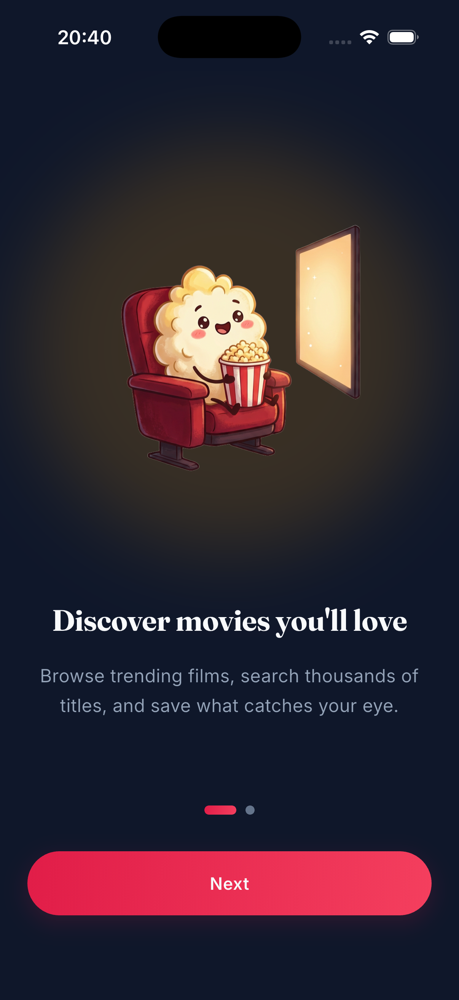
  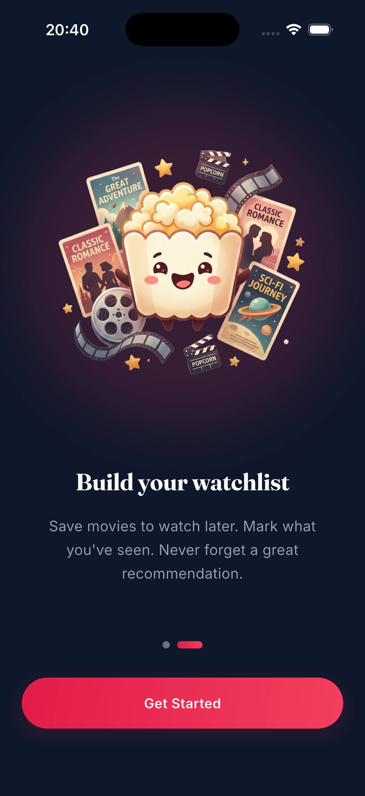
</p>

Animated splash reads the onboarding flag from Hive and routes accordingly. Returning users skip straight to Home.

### Home

<p align="center">
  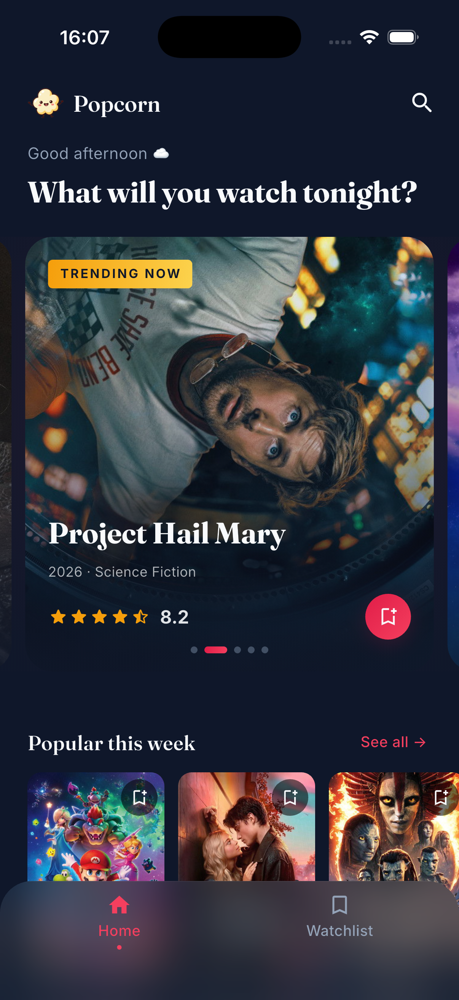
  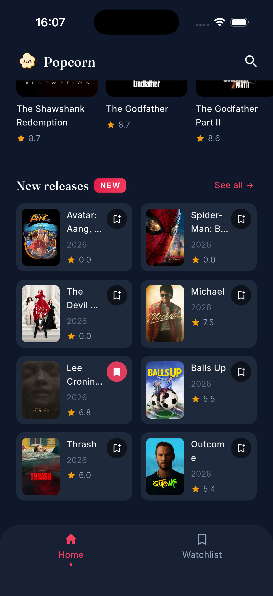
  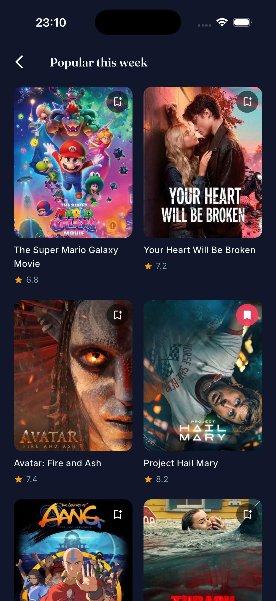
</p>

Auto-advancing hero carousel (6s cadence, peek of next card, pauses on user touch) with a subtle radial rose glow behind. Three horizontal sections (Popular, Top rated) and a 2-column **New releases** grid with its own `NEW` pill + matching shimmer silhouette. Pull-to-refresh re-hits all endpoints. `See all →` pushes a dedicated Movies List screen with proper loading/error/empty branching.

### Detail

<p align="center">
  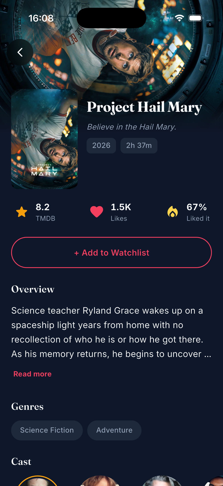
  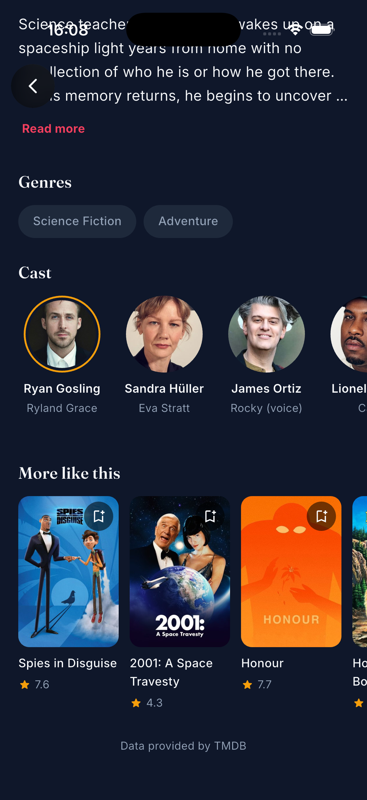
</p>

Tap any poster → Hero-animated transition into a cinematic detail screen. Backdrop header + overlapping poster, stats row (TMDB rating / likes / % liked it), expandable overview, genre pills, horizontal cast avatars (gold ring on lead, initial-letter fallback for missing photos), and a "More like this" row that reuses the Home `MovieCard`. "Add to Watchlist" is outlined when unsaved, filled gradient when saved. Three parallel TMDB calls (`/movie/:id`, `/credits`, `/similar`) load each section independently.

### Search

<p align="center">
  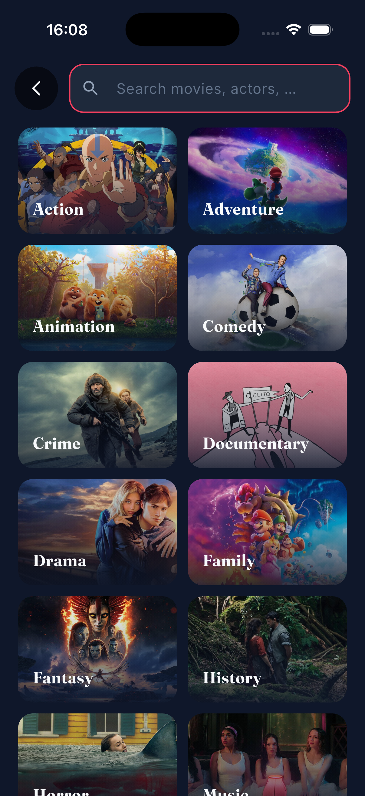
  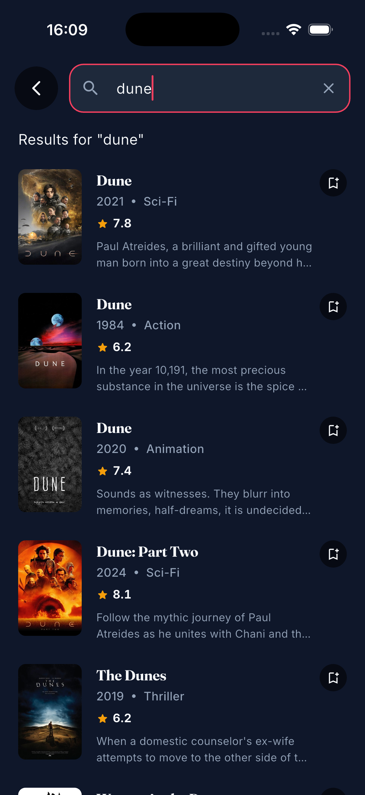
</p>

Three distinct modes driven by a single `SearchBloc`:

- **Idle** — an 18-genre grid where each tile uses a **real movie backdrop** fetched from `/discover/movie?with_genres=…`. A sequential + deduplicated fetch makes sure each genre shows a unique blockbuster, cached forever in Hive so subsequent opens are instant.
- **Typing** — 400ms debounced search via `stream_transform` (`debounce.switchMap`) so stale requests can't overwrite fresh results. Each row is a dense `SearchResultItem` (poster, title, year · genre, rating, 2-line overview, inline watchlist toggle).
- **Genre-filtered** — tap any tile → shows that genre's popular movies with an `ActiveFilterChip` to clear back to idle.

Empty state uses `problem_popcorn.png`; network failure renders an inline retry with `connection_popcorn.png`.

### Watchlist

<p align="center">
  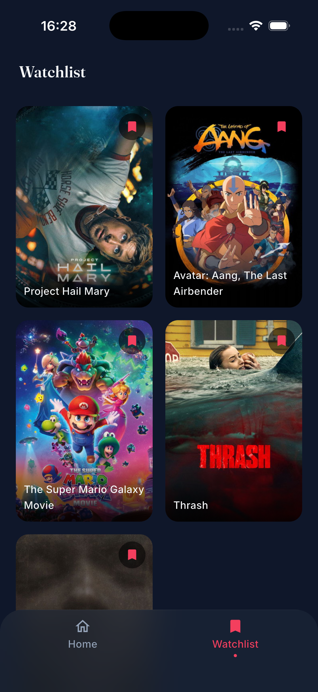
</p>

2-column poster grid with staggered fade+scale entry animation. Each poster carries the same Hero tag (`movie_poster_${id}`) as Home's `MovieCard`, so navigating Watchlist → Detail gets a shared-element transition too. Tap the bookmark chip to remove, with haptic feedback. Persisted via Hive across app restarts.

---

## Features

- 🎬 **Discover** — Trending, Popular, Top Rated sections + a 2-col New Releases grid, all from live TMDB
- 🎠 **Auto-advancing hero** — Swipeable top-5 with peek of neighbors, pauses 4s after user interaction
- 🔎 **Search** — Backdrop-driven genre grid + 400ms debounced text search + genre filter pill
- 🎞️ **Detail** — Backdrop parallax, hero-animated poster, stats, expandable overview, cast row, similar movies, inline watchlist CTA
- 🔖 **Watchlist** — Add/remove from anywhere (Home card, hero, search results, detail), saved locally in Hive, persists across restarts, shared hero transition into detail
- ✨ **Splash + Onboarding** — Animated intro for first-time users; flag stored in Hive so returning users go straight home
- 🎨 **Premium dark UI** — Fraunces + Inter typography, cinema-inspired palette (rose + gold), frosted-glass bottom nav, radial ambient glow on the hero
- 📱 **Responsive layouts** — Horizontal sections, vertical poster grids, intrinsic-height rows, matching shimmer silhouettes to avoid layout shift
- 🔄 **Pull-to-refresh** on Home
- 🧠 **Smart caching** — App-wide Bloc singletons for Home/Watchlist keep state across navigation; Hive-cached genre backdrops never re-fetch; factory-scoped blocs for Detail/Search so each entry starts fresh

---

## Tech Stack

### Runtime
| Package | Purpose |
|---|---|
| `flutter_bloc` / `bloc` | State management (sealed events + single state per slice) |
| `go_router` | Declarative routing, `ShellRoute` for bottom nav, deep-linking |
| `get_it` | Service locator / dependency injection |
| `dio` | HTTP with interceptors (bearer token, logging, error mapping) |
| `hive` + `hive_flutter` | Local NoSQL persistence (onboarding flag, watchlist, genre backdrops cache) |
| `flutter_dotenv` | Environment variable loader |
| `cached_network_image` | Network image caching + shimmer placeholders |
| `shimmer` | Loading state placeholders |
| `flutter_staggered_animations` | Grid/list entry animations (genre grid, watchlist, search results) |
| `stream_transform` | Debounced + switch-mapped search input |
| `equatable` | Value equality for events/states/entities |

### Dev
`build_runner`, `hive_generator`, `bloc_test`, `mocktail`

### Not used (intentionally)
- ❌ `injectable` — manual `getIt.registerLazySingleton` / `registerFactory` is readable and sufficient
- ❌ `fpdart` — we ship our own tiny sealed `Either<L, R>` in `lib/core/types/`
- ❌ `google_fonts` — Fraunces + Inter bundled as local `.ttf` assets for smaller dependency surface
- ❌ `share_plus` — share button explicitly out of scope for MVP

### Typography
- **[Fraunces](https://fonts.google.com/specimen/Fraunces)** — display, headlines, movie titles
- **[Inter](https://fonts.google.com/specimen/Inter)** — body text, labels, buttons

Both bundled locally under `assets/fonts/`.

---

## Architecture

Popcorn follows **Clean Architecture** pragmatically — full `data / domain / presentation` slices for feature-heavy modules with real business logic, lightweight storage classes for simple UI/app state.

### Decision rule

> Does this feature have real domain concepts and rules?
> - **Yes** (Home, Detail, Search, Watchlist) → full slice
> - **No** (onboarding flag, future settings flags) → single class under `lib/core/storage/`

### Layer breakdown (Detail as example)

```
Domain (pure Dart)
 ├── entities/{movie_detail,cast_member}.dart     Equatable
 ├── repositories/detail_repository.dart          abstract contract
 └── usecases/{get_movie_detail,get_movie_credits,get_similar_movies}.dart

Data (infrastructure)
 ├── models/{movie_detail_model,cast_member_model}.dart   fromJson
 ├── datasources/detail_remote_datasource.dart            Dio calls
 └── repositories/detail_repository_impl.dart             wraps calls with shared guard<T>()

Presentation (Flutter)
 ├── bloc/detail_{event,state,bloc}.dart   per-section MovieStatus, parallel dispatch
 ├── screens/detail_screen.dart            SingleChildScrollView + Stack for the overlap
 └── widgets/
      ├── detail_backdrop_header.dart
      ├── detail_poster_title.dart
      ├── detail_stats_row.dart
      ├── detail_actions.dart
      ├── detail_overview.dart
      ├── detail_genres.dart
      ├── detail_cast_section.dart / cast_avatar.dart
      └── detail_similar_section.dart
```

### State management

- **Sealed events + single state per feature.** Each feature has one `State` class with per-slice `status` fields (`MovieStatus.initial/loading/success/failure`) — avoids state explosion.
- **App-wide lazy singleton Blocs for Home + Watchlist.** State persists across navigation — returning to Home sees cached data, no re-fetch. Registered in `get_it`, injected via `MultiBlocProvider` in `main.dart`, mounted with `BlocProvider.value` so the singleton isn't closed on widget dispose.
- **Screen-scoped factory Blocs for Detail + Search.** Each `/movie/:id` push creates a fresh `DetailBloc`; each `/search` open creates a fresh `SearchBloc`. Transient state, no leak risk.
- **Event transformers for debounce.** `SearchBloc` uses `stream_transform`'s `debounce(400ms).switchMap` so a burst of keystrokes collapses to one request, and in-flight stale requests get cancelled.

### Error handling

Typed `Failure` (for `Either`) and matching `Exception` hierarchies live in `lib/core/error/failures.dart` — server / network / not-found / unauthenticated / cache. `DioClient`'s interceptor maps `DioException` → these exceptions, and every repository funnels calls through `guard<T>()` in `lib/core/error/guard.dart` so exceptions become `Left(Failure)` at the domain boundary. UI code never sees a `throw`.

### Routing

`go_router` with a `ShellRoute` wrapping `/` and `/watchlist` in a shared glass nav shell. Other routes are top-level and render full-screen.

```dart
initialLocation: '/splash',
ShellRoute → GlassNavShell
 ├── / → HomeScreen
 └── /watchlist → WatchlistScreen
(top-level)
 ├── /splash → SplashScreen
 ├── /onboarding → OnboardingScreen
 ├── /search → SearchScreen
 ├── /movie/:id → DetailScreen
 └── /movies/:type → MoviesListScreen   // "See all" destination
```

---

## Folder Structure

```
lib/
├── core/
│   ├── constants/              # Top-level const strings (URLs, image sizes, Hive keys)
│   ├── di/injection.dart       # get_it wiring (singletons + factories)
│   ├── error/
│   │   ├── failures.dart       # Failure + Exception hierarchies
│   │   └── guard.dart          # guard<T>(fetch) — shared data→domain boundary
│   ├── network/                # DioClient, ApiEndpoints
│   ├── router/                 # GoRouter, GlassNavShell
│   ├── storage/                # Simple Hive wrappers (onboarding flag)
│   ├── theme/                  # Colors, text styles, M3 theme
│   ├── types/either.dart       # Sealed Either<L, R> + Left/Right
│   └── usecase/usecase.dart    # UseCase<Success, Params> + NoParams
│
├── features/
│   ├── splash/                 # Animated logo, routes via onboarding flag
│   ├── onboarding/             # PageView + Get Started
│   │
│   ├── home/
│   │   ├── data / domain /
│   │   └── presentation/
│   │       ├── bloc/           # home_{event,state,bloc}.dart — parallel dispatch
│   │       ├── screens/        # home_screen, movies_list_screen
│   │       └── widgets/        # home_hero_section, movie_card, movie_section,
│   │                           # movie_list_item, new_releases_grid (+ NewReleasesShimmer)
│   │
│   ├── detail/
│   │   ├── data / domain /
│   │   └── presentation/
│   │       ├── bloc/           # detail_{event,state,bloc}.dart
│   │       ├── screens/        # detail_screen
│   │       └── widgets/        # backdrop_header, poster_title, stats_row, actions,
│   │                           # overview, genres, cast_section, cast_avatar,
│   │                           # similar_section
│   │
│   ├── search/
│   │   ├── data / domain /
│   │   └── presentation/
│   │       ├── bloc/           # search_{event,state,bloc}.dart — debounce + switchMap
│   │       ├── screens/        # search_screen — AnimatedSwitcher across 3 modes
│   │       └── widgets/        # search_app_bar, active_filter_chip,
│   │                           # genre_grid, genre_card,
│   │                           # search_results_list, search_result_item,
│   │                           # search_empty_state, search_error_state
│   │
│   └── watchlist/
│       ├── data/watchlist_storage.dart       # Hive wrapper
│       └── presentation/
│           ├── bloc/           # watchlist_{event,state,bloc}.dart
│           ├── screens/        # watchlist_screen — staggered grid
│           └── widgets/        # watchlist_poster_card (Hero-tagged),
│                               # watchlist_empty, watchlist_toggle_button
│
├── shared/
│   └── widgets/                # Cross-feature widgets
│       ├── popcorn_button.dart         # Gradient / outlined pill CTA
│       ├── popcorn_shimmer.dart        # Shimmer wrapper w/ default surface fill
│       ├── poster_fallback.dart        # Missing-poster placeholder (icon + bg)
│       ├── glass_back_button.dart      # Blurred 48dp round back button
│       ├── pressable_scale.dart        # Tap-to-shrink + haptic wrapper
│       ├── movie_rating.dart           # Star + voteAverage row
│       ├── app_empty_state.dart        # Image + title + subtitle (full screen)
│       └── app_error_state.dart        # Icon/image + title + retry (PopcornButton)
│
└── main.dart                                  # Bootstrap: dotenv → Hive → DI → runApp
```

---

## Getting Started

### Prerequisites
- Flutter **3.10+** (Dart 3.x)
- A free TMDB v4 read-access token — [grab one here](https://www.themoviedb.org/settings/api) or follow the [walkthrough on Medium](https://medium.com/@ozyurek.aydanil/how-to-get-a-tmdb-api-key-even-if-your-project-doesnt-exist-yet-fae8845f00c6) if it's your first time

### Setup

```bash
git clone https://github.com/<you>/popcorn.git
cd popcorn

# 1. Create your env file
cp .env.example .env

# 2. Paste your TMDB token into .env
#    TMDB_ACCESS_TOKEN=eyJhbGciOi...

# 3. Install dependencies
flutter pub get

# 4. Run
flutter run
```

### Font assets

The project uses **Fraunces** and **Inter**, bundled locally. They live at:
```
assets/fonts/fraunces/Fraunces-{Regular,SemiBold,Bold}.ttf
assets/fonts/inter/Inter-{Regular,Medium,SemiBold,Bold}.ttf
```
Files are already in the repo; no download needed.

### Environment

`.env` is **gitignored** — never commit your token. `.env.example` is the template others clone and fill in.

---

## Project Conventions

Conventions are defaults, not dogma — but they hold across the codebase and make new slices easy to predict.

### Naming + structure

- **Screens, not Pages.** Mobile idiom: `home_screen.dart` → `class HomeScreen`, lives in `screens/` folder.
- **`feature/data/` + `feature/domain/` + `feature/presentation/`** slices for anything with real rules. Splash, Onboarding, and core/storage are simpler — single classes.

### Dart 3 features we lean on

- **Sealed classes for events.** `sealed class HomeEvent`, `SearchEvent`, `DetailEvent`, `WatchlistEvent` — subclasses are `final class`, compiler enforces exhaustive handling in the bloc.
- **`final class` for states.** Single state per feature, `Equatable`, immutable via `copyWith`. Not sealed — we use status enum fields instead of state-per-status classes (see below).
- **Sealed `Either<L, R>`** in `lib/core/types/either.dart` with `Left` / `Right` subclasses and a `fold<T>()` method. No `fpdart`.
- **Switch expressions** for status-driven UI: `switch (state.status) { MovieStatus.loading => … }` — no nested `if/else` ladders.
- **Wildcard `_` parameters** for unused callback args (e.g. `placeholder: (_, _) => …`).

### Top-level first, `abstract final class` only when namespacing earns its keep

Dart's guidance is "avoid classes with only static members" — prefer top-level declarations. We follow that by default:

- **Top-level `const`** for plain strings that read fine unprefixed: `tmdbBaseUrl`, `posterMedium`, `backdropLarge`, `watchlistBox`, `settingsBox`, `genreBackdropsBox`, … — all in `lib/core/constants/app_constants.dart`, zero classes.
- **`abstract final class`** only where the *group* is the semantic unit and the prefix improves readability: `AppColors.primaryRose`, `AppTextStyles.headlineMedium`, `AppTheme.darkTheme`, `ApiEndpoints.movieDetail(id)`, `MovieGenres.all`. A bare `primaryRose` or `trending` at top level would be noise; the class name *is* the namespace.

Rule of thumb: if you catch yourself importing three related constants together, consider an `abstract final class`; if each stands on its own, keep it top-level.

### State modeling

- **One `State` class per feature, with status enums per section.** `HomeState` has `trendingStatus`, `popularStatus`, `topRatedStatus`, `genresStatus` — each section loads independently, failures don't cascade. Same pattern in `DetailState` (movieStatus / castStatus / similarStatus) and `SearchState` (resultsStatus / backdropsStatus).
- **`MovieStatus` enum is shared**, defined once in `home_state.dart` and re-exported (`export 'home_state.dart' show MovieStatus;`) from every other state file. One enum, three names would be worse.
- **`copyWith` is the only mutation path.** Events → bloc handler → `emit(state.copyWith(...))`. Never mutate collections in place.

### Data layer

- **`Either<Failure, T>` at the repository boundary.** Data sources throw; repositories funnel calls through the shared `guard<T>()` in `lib/core/error/guard.dart` that catches each `*Exception` and maps to the matching `*Failure`. Presentation never sees exceptions.
- **Datasources return models; repositories return entities.** `MovieModel extends Movie` + `fromJson`; UI code touches `Movie` only.

### Styling

- **No hardcoded colors in widgets.** Everything goes through `AppColors.*`. Genre tiles used to ship their own gradient stops in `MovieGenres`; we removed them once backdrops replaced the flat design.
- **Fraunces for display**, Inter for body. Never both in one heading.

### Touch targets

- **44×44 minimum tap targets** on anything the user has to hit — back buttons, read-more links, remove chips, genre cards. Visual size can be smaller; hit target is not.

---

## Roadmap

- [x] Architectural scaffolding (DI, router, theme, error types, typography)
- [x] Splash + onboarding flow with Hive-backed first-run flag
- [x] Home discovery (hero carousel + sections + new releases grid + auto-advance + radial glow)
- [x] "See all" → Movies List screen with loading/error/empty branching
- [x] Watchlist with local persistence, shared-element Hero into detail, staggered entry
- [x] **Detail screen** — backdrop, overlapping hero poster, stats, overview, genres, cast, similar
- [x] **Search** — 3-mode flow (idle/typing/genre-filtered), backdrop-powered genre grid with Hive-cached deduped fetch, 400ms debounced text search
- [ ] Pagination for Movies List (infinite scroll beyond page 1)
- [ ] Tests — Bloc unit tests with `bloc_test` + `mocktail`
- [ ] CI — GitHub Actions (`flutter analyze` + tests on PR)

---

## Credits

- Movie data & images courtesy of [The Movie Database (TMDB)](https://www.themoviedb.org/). This product uses the TMDB API but is not endorsed or certified by TMDB.
- Fonts: [Fraunces](https://fonts.google.com/specimen/Fraunces) and [Inter](https://fonts.google.com/specimen/Inter), SIL Open Font License.
- Popcorn character illustrations — custom assets.
